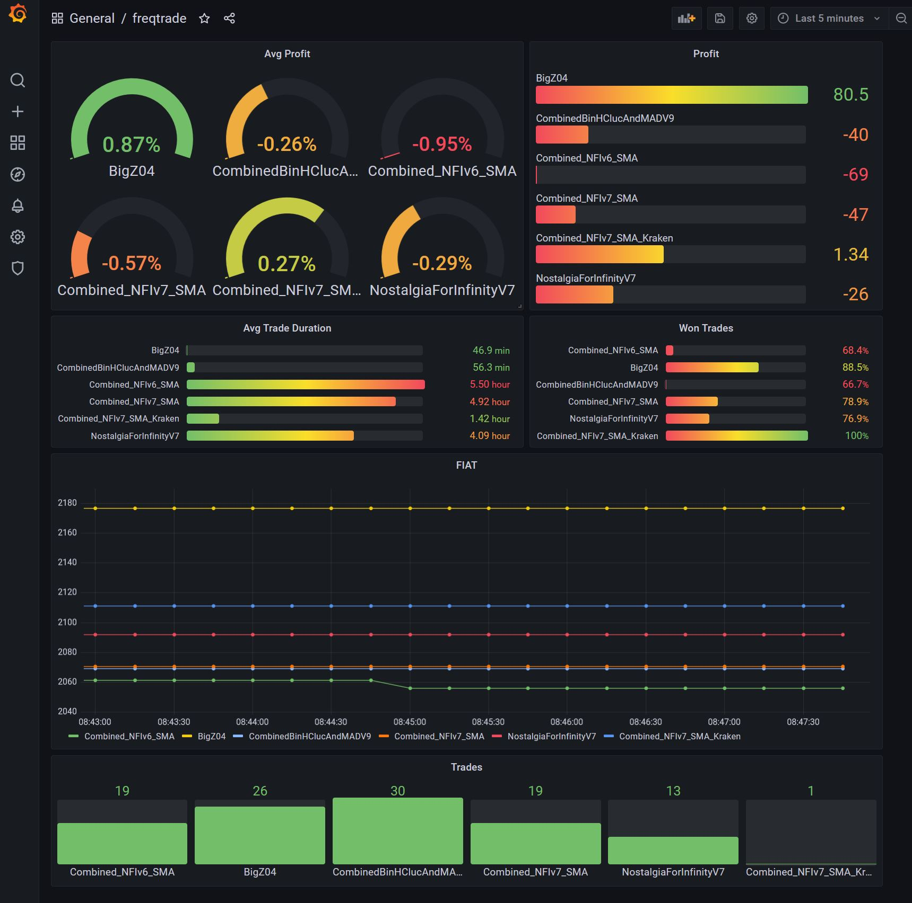
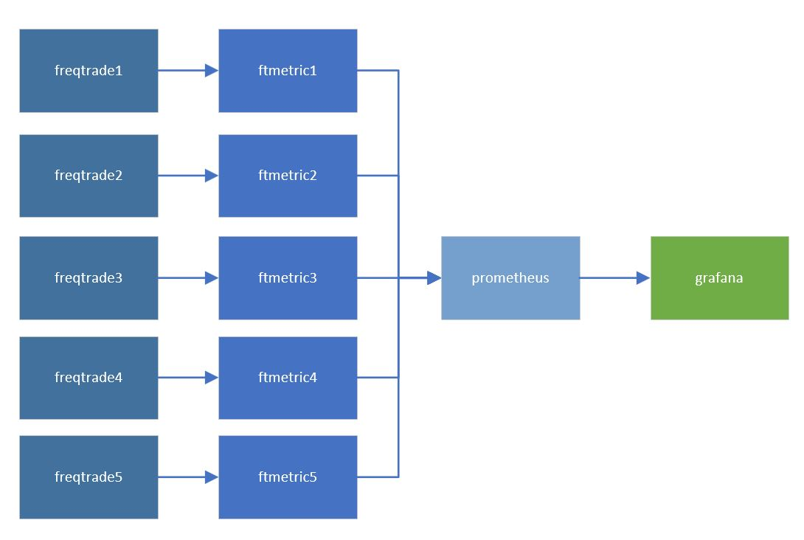

# ft_grafana
# Grafana freqtrade integration

## Introduction

> Quickstart for docker to provide a Grafana Dashboard for several freqtrade instances.
> See https://github.com/freqtrade/freqtrade
> Uses ft_metric see https://github.com/kamontat/fthelper/ 

  

## Installation

> Follow the instrucions https://www.freqtrade.io/en/stable/docker_quickstart/ copy the files from this repo to ft_userdata

Deploy Containers
> docker-compose -f docker-compose-grafana.yml up
 

  

Setup Grafana Datasource
> http://127.0.0.1:3000/datasources
> Add a Prometheus Data Source

  

Import Grafana dashbord definition
> http://127.0.0.1:3000/dashboards
> Upload freqtrade_grafana_dashboard.json

## FAQ
< t.b.d
